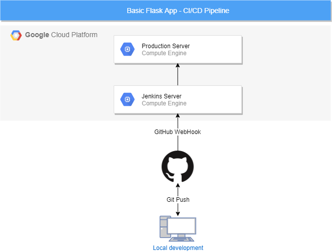

# Flask App - Jenkins CI/CD Pipeline

## A very basic ToDo app built on Flask that triggers a Jenkins CI/CD Pipeline

### Architecture diagram

# **How it works**

## **1. Local development**

The web application is developed in local systems and changes are commited to GitHub repository.

## **2. GitHub**

GitHub is integrated with WebHook, so that it can trigger Jenkins as soon as changes are pushed to master branch.

## **3. Jenkins Pipeline**

Jenkins is triggered from GitHub and it will execute the Jenkins Pipeline added in this repository. This pipeline is composed of 5 stages:

    - Checkout SCM changes
    - Execute tests. For this very basic webapp, no tests were developed. However, it is useful to bear in mind this step. In this case, it will echo a message.
    - Build Docker Image. It will build the docker image used for this Flask webapp.
    - Push Docker Image. In this stage, the docker image will be pushed to my docker hub repository.
    - Deploy. Lastly, Jenkins will deploy the latest version of the application to the production server. The steps include in this stage are:
        * Remove running containers.
        * Pull latest version of docker image.
        * Run the container on port 80.

## **4. Production Server**

The application will run in port 80 on the production server.
